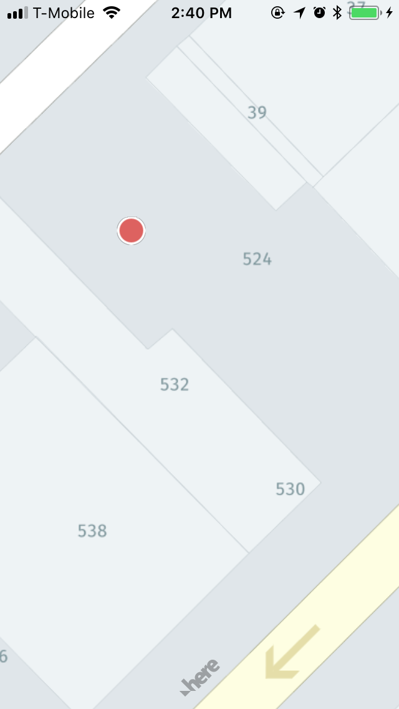

This is an example of Navisens' SDK integration with Here's SDK.

Get a key from Here's [website](https://developer.here.com/develop/mobile-sdks?create=Freemium-Basic&keepState=true&step=terms).<br/>
Then fill in the `YOUR_APP_ID` and `YOUR_APP_CODE` with the tokens provided by Here in `AppDelegate.swift`.

Then retrieve a Navisens SDK key [here](https://navisens.com/).  
And add it to the `runMotionDna` method in the `ViewController.swift` file.

When you are done with all your key retrievals, run:
```
pod install // Will install MotionDna SDK and Here SDK
open  ios-here-helloworld.xcworkspace // Will launch xcode
```

After completing these steps should be seeing the Navisens position on the Here canvas.

Have fun!



